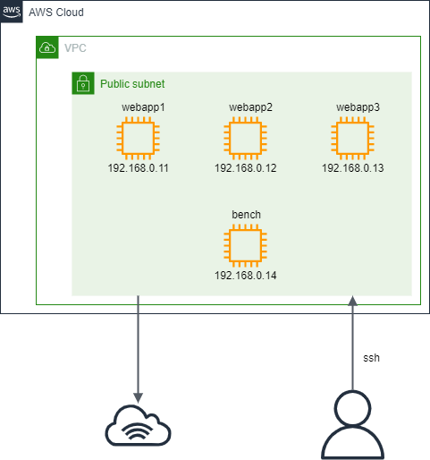
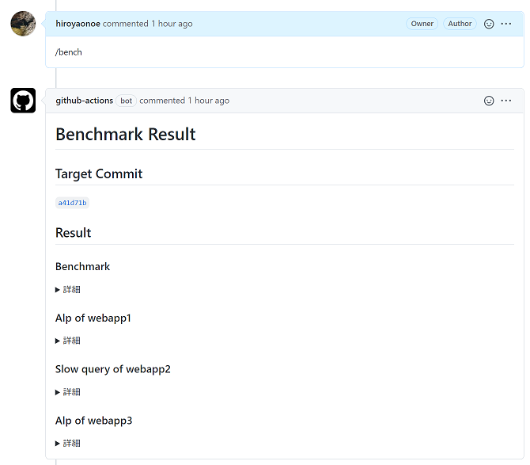

# Github Actions, Terraformによるベンチマーク・計測自動実行の仕組み
[`.github/workflows/run-bench.yaml`](../.github/workflows/run-bench.yaml)
## 大まかな流れ
ベンチマークを実行したいPull Requestで`/bench`とコメントすると以下が実行される
1. Terraformを用いてAWSのリソースを作成する
2. リソースが作成されたことを確認する
3. ベンチマークサーバーに接続してベンチマークを実行する
4. 実行サーバー３台それぞれに接続して，nginxのログやMySQLのスロークエリログの集計結果を取得する
5. 作成したAWSのリソースを削除する
6. ベンチマークの結果・計測したデータなどを該当のPull Requestにコメントする

## 各ステップについての説明
### 1. Terraformを用いてAWSのリソースを作成する
[`terraform`](../terraform)内のファイルを用いて，AWSのリソースを作成する．作成するインスタンスやネットワークの詳細は以下の通りである．

### 2. リソースが作成されたことを確認する
EC2インスタンスの作成時にUserDataを用いてシェルスクリプト([`init_instance.tpl`](../terraform/init_instance.tpl))を実行している．(将来的にはAnsibleに書き換える予定)
TerraformのApply成功時点ではUserDataのスクリプトが実行完了したかどうかがわからないため，sshの疎通確認によって実行完了したかどうかを判断する．

### 3. ベンチマークサーバーに接続してベンチマークを実行する
sshによってベンチマークサーバーに接続し，ベンチマークを実行する．

### 4. 実行サーバー３台それぞれに接続して，nginxのログやMySQLのスロークエリログの集計結果を取得する
３台の実行サーバーのうち２台がアプリを，１台がDBを実行している．アプリサーバーについてはnginxのログをalpで集計した結果を取得する．DBサーバーについてはMySQLのスロークエリログを集計した結果を取得する．

### 5. 作成したAWSのリソースを削除する
`terraform destroy`によってAWSリソースを削除する．このステップはこれ以前のステップが成功したか否かに関わらず，必ず実行する．

### 6. ベンチマークの結果・計測したデータなどを該当のPull Requestにコメントする
ステップ3, 4で取得した各種データを該当のPull Requestにコメントする．

